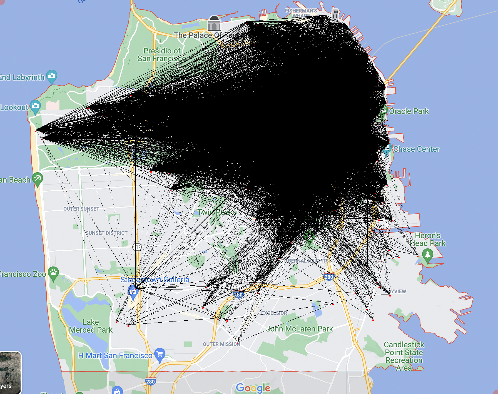
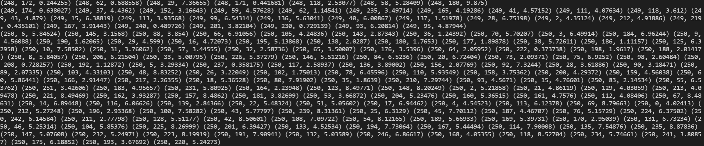
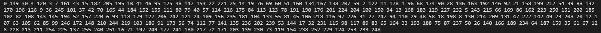
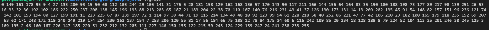
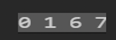
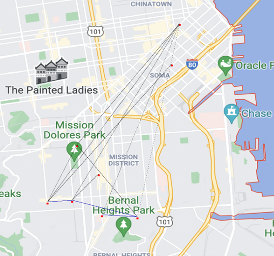

### CS225 FA2021 Final Project

## Result

After data cleansing and running algorithms, we made the following discoveries. 

Regarding the data, I found lyft bike user information across the US too massive to process, therefore narrowed down to San Francisco only. After filtering in excel based on the abbreviations in the bikeID from original data, I got 28670 trips (used as edges) that took place in San Francisco in October 2021. After dropping repeated stations in Python, I obtained a dataset with 256 unique stations in San Francisco, which are used as vertices in our algorithms in the next part. 

For the algorithms, I intended to address the following questions: utilization and accessibility of lyft bikes in San Francisco, shortest path for bike inspection, and optimum proposal based on most & least travelled routes. 

The simplified evaluation of accessibility can be determined by the ratio of the number of bikes and number of visits: the higher the ratio, the more accessible are the lyft bikes. (ie. people wait for a shorter time when they try to access lyft bikes) With 256 unique stations and  approximately 15 bikes per station, the range of accessibility ratio is as follows: SF-J23-1 with ratio 0.0033 to SF-Depot-2 with 5, which is the exact opposite of the popularity. Popularity of stations is further addressed in the most & least visited station section. 

To address the most & least visited routes, I equalized the question through estimating most & least visited stations. According to station popularity data, which is generated through a simple dictionary that tracks the popularity (how many times visited) of stations, we got the top five most visited and top five least visited stations across San Francisco. The top five most visited stations were : SF-J23-1 (4489 visits), SF\_G27 (3656 visits),  SF-H26(3388 visits), SF-E29-2 (3268 visits), SF-N22-2 (3062 visits). The top five least visited stations were:  SF-Depot-Minnesota St outbound (5 visits), SF-Depot-2 (3), SF-X14(16 visits), SF-Z16(17 visits), SF-Y25(19 visits). 

Based the above results, I suggest Lyft to add more bikes at the most visited stations (ie. stations with lower accessibility ratios) to optimize user experience, and to decrease bikes at the least visited stations (ie. station with really high accessibility ratios) to an accessibility ratio close to 1 to minimize economic  cost.

To illustrate algorithm output of our dataset, I will be presenting results using full dataset output and a small testing dataset output.

1. Full dataset graphic output: represents all 28670 trips with 256 unique stations in San Francisco in October, 2021.

**Graph representation**:

In this graph, I used an adjacency list approach to construct the graph, where the graph consists of a vector of vectors of edges. Each subvector inside the vector represents a vertex that uses the index as its identification(same index used in nodes_data.csv).Each subvector(aka.vertex) contains all the nodes adjacent to it as pairs.

For example, this 2D vector has two elements. The first element represents station 0 (using index of vector)

<<(adjacent station to station 0, distance from this adjacent station to station 0),(),()>, <(),()>>

**Whole graph BFS output:** each number represents a station that will be visited using bfs.

**Heuristics solution to TSP:** in my TSP, the maintenance team needs to visit all the stations in San Francisco while travelling the least distance. The output below gives us a heuristic solution: the driver need to visited the station in the order listed below and this route is the heuristic “minimum cost” path. 

2. Graphical and console output of a smaller data (to demonstrate Djikstra shortest path algorithm)

Shortest path console output:

“Finding Shortest path” and full graphical output on a smaller dataset, marked in blue and black respectively in the map below:
The line in blue is the shortest path from 0 to 7 (0 is the leftmost node, while 7 is the node right below letter"e")
You can see here that blue line is indeed the shortest path since the there are other path that took a huge detour to the upper right corner

